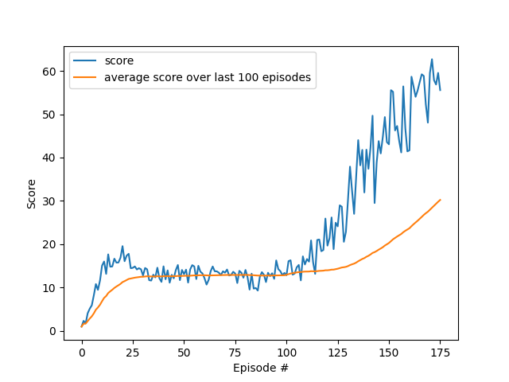
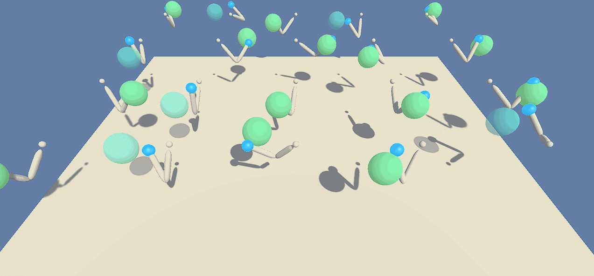

### Algorithm:
The algorithm used for solving the unity environment is the Deep Deterministic Policy Gradient algorithm. In this algorithm four neural networks are used. The policy network gets a state as an input and outputs an action. 
The Q-Value network gets a state and an action as an input and outputs the corresponding Q-Value. Both networks have local versions for computing the corersponding values in the algorithm and target versions that are used
for computing the next action and the next state during the process of learning. Just the local networks are trained and the target networks are updated by computing a convex combination of themselves and the corresponding local network. 
This process is called soft update. Because the actions are deterministic, the algorithm will not explore the environment. To tackle this problem, noise is added to the action returned by the policy network. The algorithm interacts with the environment 
(in this case 20 copies of the same environment), saves the data received from the environment in the replay buffer and learns. In the learning process, samples are randomly choses from the replay buffer and with these samples, the local networks
are trained. The loss for the Q-value network is the TD-error and for the policy network the mean of the negative Q-values computed when the input is the given state and the action computed by the policy network. Afterwards, the target 
networks are updated and the process starts again.

    ~~~~
### Hyperparameters:
The following list shows the hyperparameters chosen for learning in the best version. For more details see file "hyperparameters.py".
LOAD = False # loading neural networks from file
FILENAME_FOR_LOADING="reacher_20"
SAVE = True# saving neural networks to file
FILENAME_FOR_SAVING="reacher_20"
PLOT=True
PLOTNAME="reacher_20_9.png"
TRAINMODE = False
VAL_ENV_SOLVED = 30

MAX_NR_EPISODES= 2000000
UPDATE_EVERY = 20
NR_UPDATES=200
BUFFER_SIZE = 100000  # replay buffer size
BATCH_SIZE = 128      # minibatch size
GAMMA = 0.99            # discount factor
TAU = 0.001              # for soft update of target parameters
LR_ACTOR = 0.0001        # learning rate of the actor
LR_CRITIC = 0.0001       # learning rate of the critic
WEIGHT_DECAY = 0        # L2 weight decay

### Results:
The following figure displays the score of the agent during the learning process over 175 episodes, each consisting of 1000 steps. The average score per episode in the episodes 75-175 is 30.0 and therefore the environment is considered solved after 525 episodes. 

The following gif file displays the trained version:

 

### Future Improvements:
- using a prioritized experience replay buffer
- using bootstrapping
- convolutional layers might the improve agent
    
    

